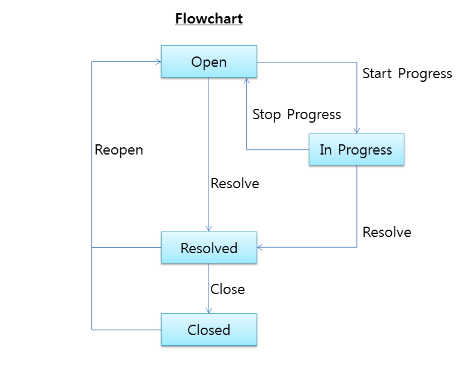

## 이슈트래커
주요 기능 : 이슈 생성, 할당, 진행, 완료  
네이버 아이디 로그인 API을 사용하여 사용자 인증을 합니다.  



### 사용 기술

* Gradle
* Spring Boot
* Spring Web
* Spring Security
* Spring Boot Oauth2
* 네이버 아이디 로그인
* H2
* Mybatis


### 1. 설정
#### 네이버 아이디 API 사용 설정
application.yml  
CLIENT\_ID, CLIENT\_SECRET 부분은 네이버 API에서 받아오셔도 되나,  
원할한 테스트를 위해 코드 작성자의 것을 넣어두었습니다.  
(일정시간이 지나면 삭제예정)   

  
```
naver:
  client:
    clientId: CLIENT_ID
    clientSecret: CLIENT_SECRET
    accessTokenUri: https://nid.naver.com/oauth2.0/token
    userAuthorizationUri: https://nid.naver.com/oauth2.0/authorize
    tokenName: oauth_token
    authenticationScheme: header
    clientAuthenticationScheme: form
  resource:
    userInfoUri: https://openapi.naver.com/v1/nid/me
```

### 2. 실행방법:
실행환경 : java8, gradle4.3.1

```bash
gradle bootRun
  ```

### 3. 브라우저에서 아래 주소 입력 
[http://localhost:8080](http://localhost:8080)

### 4. API
#### Issues
URIs relative to http://localhost:8080/api, unless otherwise noted  
| Method        | HTTP request          | Description                    |
|---------------|-----------------------|--------------------------------|
| GET           | /issues/**{id}**     | Gets a issue data by id.       |
| GET           | /issues?title=&...    | Lists the issue data by query. |
| POST          | /issues               | Create a issue.                |
| PATCH         | /issues/**{id}**     | Update a issue.                |            
| DELETE        | /issues/**{id}**     | Delete a issue.                |            

#### Comments
URIs relative to http://localhost:8080/api, unless otherwise noted  
| Method        | HTTP request          | Description                    |
|---------------|-----------------------|--------------------------------|
| GET           | /issues/**{issueId}**/comments/**{id}**     | Gets a comment data by id.       |
| GET           | /issues/**{issueId}**/comments               | Lists the comment.               |
| POST          | /issues/**{issueId}**/comments               | Create a comment.                |
| PATCH         | /issues/**{issueId}**/comments/**{id}**     | Update a comment.                |            
| DELETE        | /issues/**{issueId}**/comments/**{id}**     | Delete a comment.                |            

#### Codes
URIs relative to http://localhost:8080/api, unless otherwise noted  
| Method  | HTTP request | Description         |
|---------|--------------|---------------------|
| GET     | /codegroups/{codeGroup}/codes    | Lists the codes. |

#### Users
URIs relative to http://localhost:8080/api, unless otherwise noted  
| Method  | HTTP request | Description         |
|---------|--------------|---------------------|
| GET     | /api/users    | Lists the users. |
| GET     | /api/me       | Gets my profiles. |